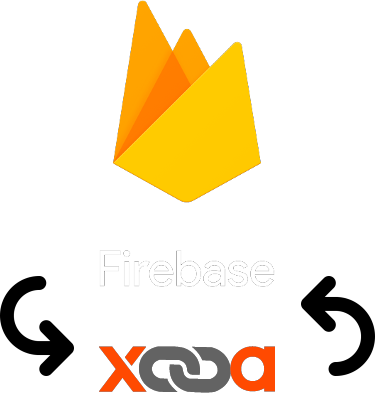

[![Contributors][contributors-shield]][contributors-url]
[![Forks][forks-shield]][forks-url]
[![Stargazers][stars-shield]][stars-url]
[![Issues][issues-shield]][issues-url]
[![MIT License][license-shield]][license-url]

<!-- PROJECT LOGO -->
 

  

<h3 align="center">Firebase Xooa Connector</h3>

  

    A Google Cloud Function to enable authenticating <a href="https://xooa.com/blockchain/apps">Xooa App Platform</a> users via Firebase Auth
     
     
    <a href="https://github.com/Simon-Ince/firebase-xooa-connector/issues">Report Bug</a>
    ·
    <a href="https://github.com/Simon-Ince/firebase-xooa-connector/issues">Request Feature</a>
  

<!-- TABLE OF CONTENTS -->

  
Table of Contents

  <ol>
    <li>
      <a href="#about-the-project">About The Project</a>
      <ul>
        <li><a href="#built-with">Built With</a></li>
      </ul>
    </li>
    <li>
      <a href="#getting-started">Getting Started</a>
      <ul>
        <li><a href="#prerequisites">Prerequisites</a></li>
        <li><a href="#installation">Installation</a></li>
      </ul>
    </li>
    <li><a href="#usage">Usage</a></li>
    <li><a href="#contributing">Contributing</a></li>
    <li><a href="#license">License</a></li>
  </ol>

<!-- ABOUT THE PROJECT -->
## About The Project

The <a href="https://xooa.com/blockchain/apps">Xooa App Platform</a> currently offers two ways to authenticate users, either using a Xooa user/password combination, or Auth0.

This Cloud Function offers a third options, authenticating via Firebase Auth.

Although it's possible to use any of these three options at any one time, it's not advised to mix and match your approach, user accounts created via any one of these options are not authenticatable by the the remaining options. e.g if a user account was created via Auth0, the user will not be able to sign in via the Xooa email/password page, or this Cloud Function.

__Limitations__

This Cloud Function does not currently support accessing the Xooa Marketplace through Firebase Auth, and is limited to the use of the Xooa API only.

(<a href="#top">back to top</a>)

### Built With

* [Python 3.9](https://www.python.org/downloads/release/python-390/)
* [Flask](https://flask.palletsprojects.com/)
* [firebase_admin](https://firebase.google.com/docs/reference/admin/python/firebase_admin/)
* [Cloud Functions](https://cloud.google.com/functions/)

(<a href="#top">back to top</a>)

<!-- GETTING STARTED -->
## Getting Started

### Prerequisites

TODO...

<!-- CONTRIBUTING -->
## Contributing

Contributions are what make the open source community such an amazing place to learn, inspire, and create. Any contributions you make are **greatly appreciated**.

If you have a suggestion that would make this better, please fork the repo and create a pull request. You can also simply open an issue with the tag "enhancement".
Don't forget to give the project a star! Thanks again!

1. Fork the Project
2. Create your Feature Branch (`git checkout -b feature/AmazingFeature`)
3. Commit your Changes (`git commit -m 'Add some AmazingFeature'`)
4. Push to the Branch (`git push origin feature/AmazingFeature`)
5. Open a Pull Request

(<a href="#top">back to top</a>)

<!-- LICENSE -->
## License

Distributed under the MIT License. See `LICENSE` for more information.

(<a href="#top">back to top</a>)

<!-- MARKDOWN LINKS & IMAGES -->
<!-- https://www.markdownguide.org/basic-syntax/#reference-style-links -->
[contributors-shield]: https://img.shields.io/github/contributors/Simon-Ince/firebase-xooa-connector.svg?style=for-the-badge
[contributors-url]: https://github.com/Simon-Ince/firebase-xooa-connector/graphs/contributors
[forks-shield]: https://img.shields.io/github/forks/Simon-Ince/firebase-xooa-connector.svg?style=for-the-badge
[forks-url]: https://github.com/Simon-Ince/firebase-xooa-connector/network/members
[stars-shield]: https://img.shields.io/github/stars/Simon-Ince/firebase-xooa-connector.svg?style=for-the-badge
[stars-url]: https://github.com/Simon-Ince/firebase-xooa-connector/stargazers
[issues-shield]: https://img.shields.io/github/issues/Simon-Ince/firebase-xooa-connector.svg?style=for-the-badge
[issues-url]: https://github.com/Simon-Ince/firebase-xooa-connector/issues
[license-shield]: https://img.shields.io/github/license/Simon-Ince/firebase-xooa-connector.svg?style=for-the-badge
[license-url]: https://github.com/Simon-Ince/firebase-xooa-connector/blob/master/LICENSE.txt
[linkedin-shield]: https://img.shields.io/badge/-LinkedIn-black.svg?style=for-the-badge&logo=linkedin&colorB=555
[linkedin-url]: https://linkedin.com/in/linkedin_username
[product-screenshot]: images/screenshot.png
